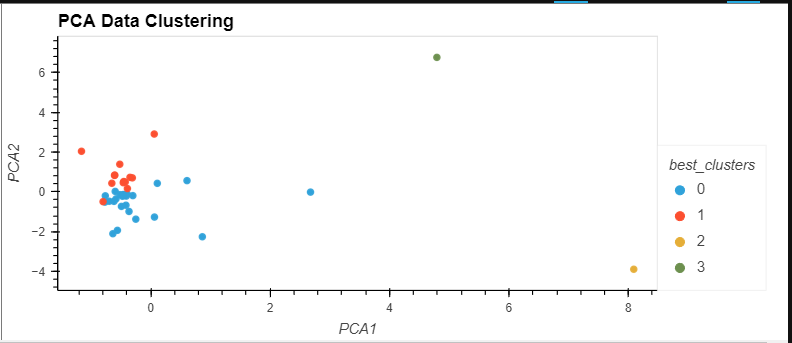

# Crypto Clustering

<h3>Project Summary</h3>
<i>"One of the hottest debates in finance and economics is whether the (crypto) market is efficient."</i> 
- Market efficiency of cryptocurrency: evidence from the Bitcoin market (Yi, Yang, Jeong, Sohn and Ahn)<super>1</super>
 

The purpose of this project is to provide an analysis as to whether the price changes of a currency over a 24-hr or 7-day period affect the overall price.

<h3>Project Activities</h3>
<h5>Load and Review Data</h5>
<ol>
<li>Rename the Crypto_Clustering_starter_code.ipynb file as Crypto_Clustering.ipynb.</li>
<li>Load the crypto_market_data.csv into a DataFrame.</li>
<li>Get the summary statistics and plot the data to see what the data looks like before proceeding.</li>

</ol>

<h5>Prepare the Data<h5>
<ul>
<li>Use the StandardScaler() module from scikit-learn to normalize the data from the CSV file.</li>
<li>Create a DataFrame with the scaled data and set the "coin_id" index from the original DataFrame as the index for the new DataFrame.</li>
<ul>

<h5>Find the Best Value for k Using the Original Scaled DataFrame</h5>

Use the elbow method to find the best value for k using the following steps:

<ul>
<li>Create a list with the number of k values from 1 to 11.</li>
<li>Create an empty list to store the inertia values.</li>
<li>Create a for loop to compute the inertia with each possible value of k.</li>
<li>Create a dictionary with the data to plot the elbow curve.</li>
<li>Plot a line chart with all the inertia values computed with the different values of k to visually identify the optimal value for k.</li>

</ul>

<h5>Cluster Cryptocurrencies with K-means Using the Original Scaled Data</h5>

Use the following steps to cluster the cryptocurrencies for the best value for k on the original scaled data:

<ul>
<li>Initialize the K-means model with the best value for k.</li>
<li>Fit the K-means model using the original scaled DataFrame.</li>
<li>Predict the clusters to group the cryptocurrencies using the original scaled DataFrame.</li>
<li>Create a copy of the original data and add a new column with the predicted clusters.</li>
<li>Create a scatter plot using hvPlot:</li>

<ul>

<h5>Optimize Clusters with Principal Component Analysis</h5>
<ul>
<li>Using the original scaled DataFrame, perform a PCA and reduce the features to three principal components.</li>
<li>Retrieve the explained variance to determine how much information can be attributed to each principal component.</li>
<li>Create a new DataFrame with the PCA data and set the "coin_id" index from the original DataFrame as the index for the new DataFrame.</li>
</ul>

<h5>Find the Best Value for k Using the PCA Data</h5>

Use the elbow method on the PCA data to find the best value for k using the following steps:

<ul>
<li>Create a list with the number of k-values from 1 to 11.</li>
<li>Create an empty list to store the inertia values.</li>
<li>Create a for loop to compute the inertia with each possible value of k.</li>
<li>Create a dictionary with the data to plot the Elbow curve.</li>
<li>Plot a line chart with all the inertia values computed with the different values of k to visually identify the optimal value for k.</li>

</ul>

<h5>Cluster Cryptocurrencies with K-means Using the PCA Data</h5>

Use the following steps to cluster the cryptocurrencies for the best value for k on the PCA data:

<ul>
<li>Initialize the K-means model with the best value for k.</li>
<li>Fit the K-means model using the PCA data.</li>
<li>Predict the clusters to group the cryptocurrencies using the PCA data.</li>
<li>Create a copy of the DataFrame with the PCA data and add a new column to store the predicted clusters.</li>
<li>Create a scatter plot using hvPlot:</li>

</ul>